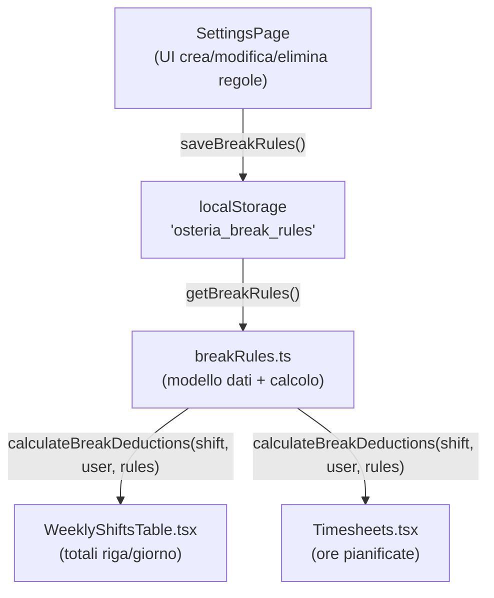

# Pause Automatiche — Piano di Implementazione

## Architettura




## 1 · Nuovo file `src/utils/breakRules.ts`

Modello dati e logica di calcolo:

```typescript
export type DayOfWeek = 0 | 1 | 2 | 3 | 4 | 5 | 6;

export interface BreakRule {
  id: string;
  title: string;
  breakStart: string;       // HH:mm — inizio finestra pausa
  breakEnd: string;         // HH:mm — fine finestra pausa
  minShiftMinutes: number;  // durata minima turno per scattare la pausa
  paid: boolean;            // true = non detrae ore; false = detrae
  departments: string[];    // [] = tutti i reparti
  roles: string[];          // [] = tutti i ruoli
  validFrom?: string;       // YYYY-MM-DD (opzionale)
  validTo?: string;         // YYYY-MM-DD (opzionale)
  daysOfWeek: DayOfWeek[];  // [] = tutti i giorni
}
```

Funzioni esportate:

- `getBreakRules(): BreakRule[]` — legge da `localStorage['osteria_break_rules']`
- `saveBreakRules(rules): void` — salva in localStorage
- `calculateBreakDeductions(shift, user, rules): number` — restituisce i minuti da detrarre per un turno specifico, filtrando per reparto, ruolo, data, giorno

## 2 · `src/components/SettingsPage.tsx`

Aggiungere una nuova sezione collassabile "Pause automatiche" (stesso pattern toggle + `AnimatePresence` delle sezioni esistenti):

- Lista delle regole salvate con nome, finestra oraria, badge "Retribuita/Non retribuita", pulsanti modifica/elimina
- Pulsante "Nuova regola" → apre un modal inline (`BreakRuleModal`) con:
  - **Generale**: Titolo · Inizio pausa + Fine pausa · Durata minima turno (stepper) · Toggle Retribuita/Non retribuita
  - **Assegna a**: chip multi-select per Reparti (Sala, Cucina, Bar) e Ruoli
  - **Applica a**: date-picker Valida dal/al (opzionale) + chip giorni settimana (Lun–Dom)
  - Bottoni: Crea / Salva · Annulla

## 3 · Integrazione nei componenti di visualizzazione

### `WeeklyShiftsTable.tsx`

- All'inizio del componente: `const breakRules = useMemo(() => getBreakRules(), [])` 
- Dove si calcola la durata mostrata nel badge e nei totali colonna/riga: sottrarre `calculateBreakDeductions(shift, user, breakRules)` dal risultato di `calculateShiftMinutesSafe`
- Il campo `deduct_break` per-turno rimane invariato (retrocompatibilità)

### `Timesheets.tsx`

- Stesso pattern: caricare le regole e applicare `calculateBreakDeductions` alle ore pianificate per i confronti pianificato/effettivo

## File modificati

- `src/utils/breakRules.ts` — **nuovo file**
- `src/components/SettingsPage.tsx` — nuova sezione + modal
- `src/components/WeeklyShiftsTable.tsx` — applicazione regole ai totali e badge
- `src/components/Timesheets.tsx` — applicazione regole alle ore pianificate

## Cosa NON cambia

- La struttura Supabase — nessuna migrazione DB
- Il campo `deduct_break` sui turni esistenti
- Tutte le funzioni in `timeCalculations.ts` — restano invariate
- I file di esportazione PDF (fuori scope, le pause automatiche non impattano l'export in questa fase)

